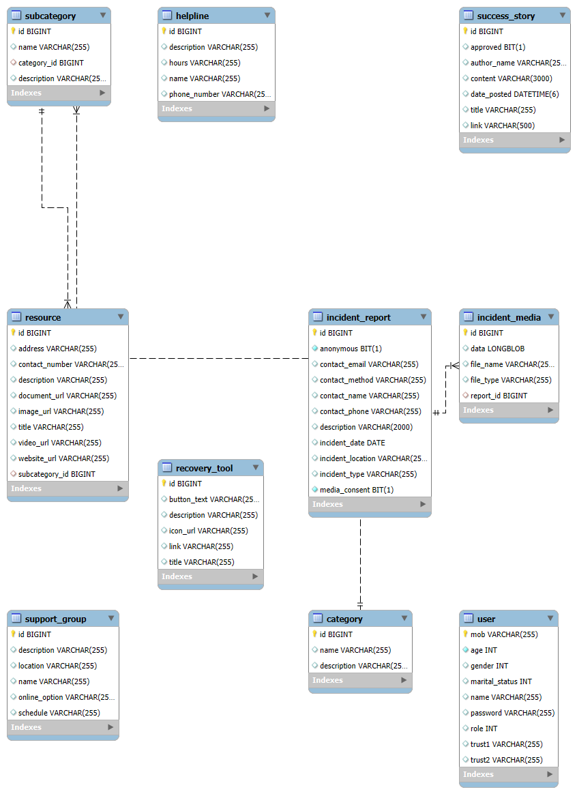
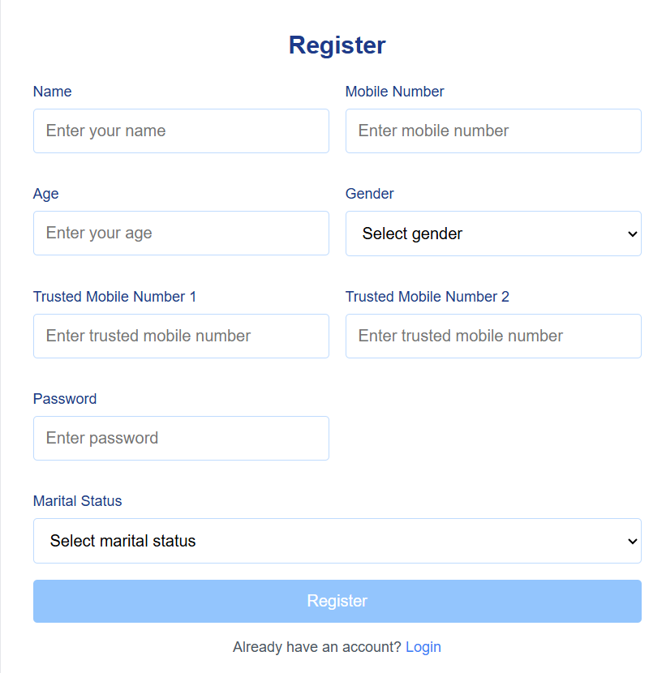
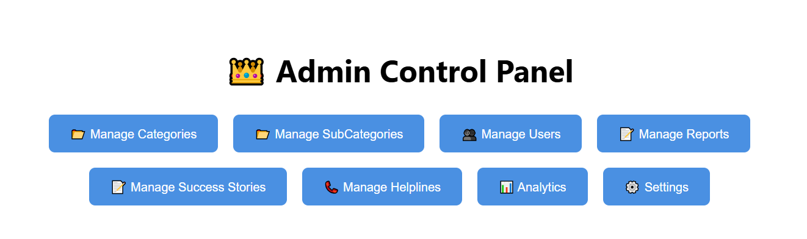

# 💬 Sahara – AI-Powered Support Platform

**Sahara** is an integrated full-stack web platform designed to assist users with real-time support, AI-driven chatbot guidance, and curated resources. The application merges modern frontend, backend, and AI technologies with structured database support.

---

## 🔥 Key Features

- 🔐 User Authentication & Role Management  
- 📚 Category-Based Resource Listings (Helplines, Support Groups, etc.)  
- 🤖 Document-based AI Chatbot with NLP & Retrieval-Augmented Generation  
- 💬 Chat History, Summarization, Feedback Tracking  
- 📊 Admin Dashboard for Resource & Success Story Management  
- 🧠 Multi-language NLP Support (Optional)  

---

## 🛠 Tech Stack

| Layer      | Technology                        |
|------------|-----------------------------------|
| Frontend   | Angular 17+, TypeScript, HTML/CSS |
| Backend    | Spring Boot (Java 17), REST APIs  |
| Chatbot    | Python 3.10+, Flask/FastAPI + FAISS |
| Database   | MySQL                             |
| DevOps     | GitHub, Postman, Maven, npm       |

---

## 🧱 Project Structure

```
Sahara/
├── backend-springboot/       # Java Spring Boot APIs
├── frontend-angular/         # Angular SPA
├── chatbot-python/           # Python AI Microservice
├── database/                 # SQL schema and ER Diagram
│   ├── schema.sql
│   └── er-diagram.png
├── docs/                     # Screenshots, architecture diagrams, postman collection
│   └── SCREENSHOTS/
├── .gitignore
└── README.md
```

---

## 🧩 ER Diagram

📌 Here is the Entity Relationship Diagram used in the project:



---

## 🏗️ System Architecture

```mermaid
graph TD;
    Angular[Client (Angular)]
    SpringBoot[Spring Boot Backend]
    PythonChatbot[Python Chatbot (Flask/FastAPI)]
    MySQL[(MySQL Database)]

    Angular -->|REST API| SpringBoot
    SpringBoot -->|REST API| PythonChatbot
    SpringBoot --> MySQL
    PythonChatbot --> MySQL
```

---

## 🚀 Getting Started

### 🔧 Prerequisites

Install the following tools on your system:

- Java 17+
- Maven
- Node.js 16+
- Angular CLI
- Python 3.10+
- MySQL Server

---

### 🛠️ Backend – Spring Boot

```bash
cd backend-springboot
./mvnw spring-boot:run
```

> 🔑 Update `application.properties` with your local MySQL credentials.

---

### 💻 Frontend – Angular

```bash
cd frontend-angular
npm install
ng serve
```

> App runs at: [http://localhost:4200](http://localhost:4200)

---

### 🤖 Chatbot – Python (Flask or FastAPI)

```bash
cd chatbot-python
pip install -r requirements.txt
python app.py
```

> API runs at: [http://localhost:5000](http://localhost:5000)

---

### 🗃️ Database Setup

```sql
CREATE DATABASE sahara;
-- Then run schema.sql in the database folder
```

---

## 📸 Screenshots

| View                 | Screenshot                                                  |
|----------------------|-------------------------------------------------------------|
| Login                |              |
| Register             |        |
| Admin Panel          |  |

> Ensure your image file names are lowercase and hyphenated for consistency.

---

## 🧠 AI Chatbot Capabilities

- NLP-Powered Question Answering  
- FAISS-Based Document Search  
- Multi-Chunk Retrieval  
- Summarized Response Generation  
- Persistent Chat History  
- Feedback Logging  

---

## 🤝 Contributing

Pull requests are welcome. For major changes, please open an issue first to discuss what you would like to change.

---

## 🔗 Connect With Me

- 🧑‍💻 **LinkedIn**: [Rohit Salve](https://www.linkedin.com/in/rohit-salve-6054b324a/)
- 💻 **GitHub**: [@RohitSalv](https://github.com/RohitSalv)
- ✉️ **Email**: salver814@gmail.com
